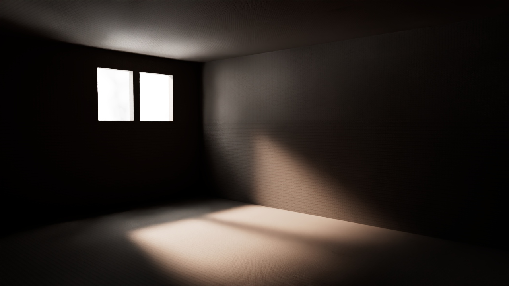

# ☀️ Lighting Study: Natural Interior Light
## 📖 Overview
This project is a dedicated study of natural light behavior within an interior space. The main goal was to achieve a realistic balance between direct sunlight and bounced light (Global Illumination), while maintaining natural contrast and depth.
## 🖼️ Final Render

## 🛠️ Technical Specifications
* **Software:** 3ds Max 2024
* **Renderer:** [Arnold]
* **Key Techniques:**
    * **Physical Sky & Sun:** For accurate daylight simulation.
    * **Volumetric Lighting:** To capture "god rays" through the window.
    * **PBR Workflow:** Realistic interaction between light and materials.
    * **Color Mapping:** Handling highlights and shadow details.

## 📁 Repository Structure
* `/renders` - High-resolution final shots and technical views.
* `/export` - FBX/OBJ files (compatible with Game Engines like Unreal/Unity).
* `/source` - Original .max project file.
